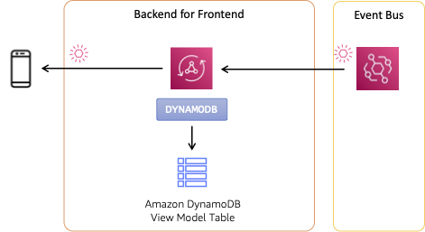

# Patterns for building event-driven web and mobile app backends

User interfaces by their nature are event driven - interactions trigger events that drive the application. But integrations between frontend and backend are often built synchronously using a request/response pattern. The samples in this repository explore patterns to enable asynchronous, event-driven integrations with the frontend. These real-world patterns bring the agility and responsiveness of EDA across client-server interactions.

## Pattern #2: AWS AppSync + Amazon EventBridge

Pattern #2 leverages the subscription operation available using [GraphQL](https://graphql.org/). Subscriptions are designed for small incremental data changes that may occur over a long-lived period of time. Common use cases for subscriptions include real-time data, such as stock updates, chat, or game scores.

[AWS AppSync](https://aws.amazon.com/appsync/) is a serverless GraphQL service that uses WebSockets to enable clients to connect for pub/sub APIs. The client connects and subscribes to the AWS AppSync API, opening a secure WebSocket connection that allows AppSync to send updates to the client. Subscription is based on the associated GraphQL operation, allowing clients to flexibly subscribe to updates of interest (e.g., broadcast or updates to a specific change).



Events are delivered by an [Amazon EventBridge](https://aws.amazon.com/eventbridge/) rule directly to the AWS AppSync GraphQL API. The EventBridge rule is configured to perform a GraphQL mutation, changing the values of the view model in an [Amazon DynamoDB](https://aws.amazon.com/dynamodb/) table. Subscriptions are invoked as a response to the mutation. To invoke a subscription in response to a mutation, configure in the GraphQL schema:

``` graphql
type Mutation {
    createFlight(input: CreateFlightInput!): Flight
}

type Subscription {
  onCreateFlight(): Flight
    @aws_subscribe(mutations: [ "createFlight" ])
}
```

An overview of the integration between EventBridge and AWS AppSync can be found in the blog post [Build real-time applications with Amazon EventBridge and AWS AppSync](https://aws.amazon.com/blogs/compute/build-real-time-applications-with-amazon-eventbridge-and-aws-appsync/). The integration requires EventBridge have an [AWS IAM](https://aws.amazon.com/iam/) execution role that allows it to perform the GraphQL mutation. Use EventBridge input transformers to provide the payload to the mutation operation in the expected format.

> Note: Pattern includes a duplicate version of the flight status DynamoDB table from the shared stack. This allows us to demonstrate the integration between AppSync and DynamoDB via resolver.

### Frontend integration

The frontend integration for this pattern uses the [Apollo Client](https://www.apollographql.com/docs/react/) library for React. Implementation can be found in [frontend/src/components/Pattern2.jsx](../../frontend/src/components/Pattern2.jsx).

Apollo was selected so that the frontend could connect to multiple GraphQL endpoints at the same time (see [`createClient`](../../frontend/src/graphql/index.js)). The Apollo client was extended with two [custom links](https://www.apollographql.com/docs/react/api/link/introduction/) to enable [AWS SigV4](https://docs.aws.amazon.com/AmazonS3/latest/API/sig-v4-authenticating-requests.html) signing of requests.

AWS AppSync supports a [variety of authorization types](https://docs.aws.amazon.com/appsync/latest/devguide/security-authz.html) but requires that one be used. API Keys are generally adequate for a demonstration but do require regular rotation. We chose to use [AWS IAM](https://aws.amazon.com/iam/) authorization through use of an [unauthenticated role](https://docs.aws.amazon.com/location/latest/developerguide/authenticating-using-cognito.html) provided by [Amazon Cognito identity pools](https://docs.aws.amazon.com/cognito/latest/developerguide/identity-pools.html). The unauthenticated role approach allows guest access to the GraphQL API, while still vending short-lived credentials (instead of a long-lived API key). The AWS SAM [template for this pattern](./template.yaml) adds permissions to the unauthenticated role to access the API.

Had multiple GraphQL endpoints not be needed for this project, we would have used the [AWS Amplify](https://docs.amplify.aws/react/build-a-backend/graphqlapi/connect-to-api/) library for React. Amplify supports SigV4 signing out-of-the-box and integrates easily with AWS services.

## Deployment

To deploy this pattern, use [AWS SAM CLI](https://docs.aws.amazon.com/serverless-application-model/latest/developerguide/install-sam-cli.html):

``` bash
sam build --base-dir ../../ && sam deploy --guided
```

> Unlike other patterns, this one does not include an AWS Lambda function and does not need a build step, it's all configuration.

Respond to the prompts:

  - `Stack Name [patterns-eventdriven-frontends-pattern2]:` *enter your own stack name or accept default*
  - `AWS Region [us-west-2]:` *select a Region, any will work*
  - `Parameter ProjectName [patterns-eventdriven-frontends]:` *keep the default or select your own*
  - `Confirm changes before deploy [y/N]:` *N*
  - `Allow SAM CLI IAM role creation [Y/n]:` *Y*
  - `Disable rollback [y/N]:` *N*
  - `Save arguments to configuration file [Y/n]:` *Y*
  - `SAM configuration file [samconfig.toml]:` *accept default*
  - `SAM configuration environment [default]:` *accept default*

### Configure frontend

To configure the frontend demo application, you will need the `GraphQLEndpoint` output from the Pattern 2 stack, in the format:

``` bash
```

In the `frontend/src/appconfig.js`, update the value as shown below. The endpoint must include `https://` at the start of the endpoint and `/graphql` at the end as shown in the output.

``` js
  pattern2: {
    endpoint: "" // `GraphQLEndpoint` from pattern 2 stack output
  },
```