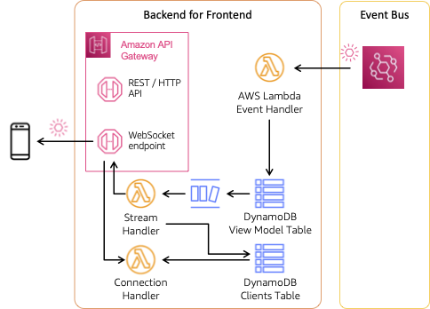

# Patterns for building event-driven web and mobile app backends

User interfaces by their nature are event driven - interactions trigger events that drive the application. But integrations between frontend and backend are often built synchronously using a request/response pattern. The samples in this repository explore patterns to enable asynchronous, event-driven integrations with the frontend. These real-world patterns bring the agility and responsiveness of EDA across client-server interactions.

## Pattern #3: Amazon API Gateway WebSockets

Pattern #3 leverages [Amazon API Gateway](https://aws.amazon.com/api-gateway/) WebSockets to deliver updates to subscribers. API Gateway WebSockets are integrated with HTTP endpoints and can be used for real-time use cases including chat applications, sports scores, and multiplayer games. API Gateway WebSocket APIs are bidirectional -- both clients and services can send messages over the connection. Pattern #3 only sends messages from service to subscribers, but the bidirectional nature of API Gateway WebSockets can also enable highly interactive applications such as collaborative writing.



API Gateway WebSockets entail managing connected clients via two predefined routes: `$conenct` and `$disconnect`. Client applications connect through a WebSocket upgrade request. On success, the `$connect` route is executed and a connection is established. In Patter #3, the `$connect` route invoke an [AWS Lambda](https://aws.amazon.com/lambda/) function that writes the connection identifier to an [Amazon DynamoDB](https://aws.amazon.com/dynamodb/) table (see [`./patterns/functions/connectionHandlers/onConnect.js`](./patterns/functions/connectionHandlers/onConnect.js)). The entry is removed when the `$disconnect` route is closed as the WebSocket connection is closed. The WebSocket connection must be active to deliver updates to subscribers.

Events are delivered by an [Amazon EventBridge](https://aws.amazon.com/eventbridge/) rule to an [AWS Lambda](https://aws.amazon.com/lambda/) function that writes to a view model stored in an Amazon DynamoDB table. Updates to that table are published on a [DynamoDB Stream](https://docs.aws.amazon.com/amazondynamodb/latest/developerguide/Streams.html). A second Lambda function (stream handler) processes batches of changes on the stream. Records passed in the batch can be filtered to only records of interest, this reduces cost and eliminates unnecessary invocations of the function.

The stream handler function retrieves a list of currently subscribed clients from the DynamoDB subscriptions table and then publishes updates to each subscriber with the API Gateway `PostToConnection` API. The `PostToConnection` API sends the message payload to only one subscriber at a time.

Pattern #3 publishes messages to all current subscribers, there is no per-client filtering. In other words, all clients connected to the WebSocket will receive all flight updates that the stream handler sends. More granular filtering would require, for example, attaching a flight identifier to the WebSocket connection ID. The stream handler would then lookup only those connections associated with a particular flight when processing an event. The [web push pattern](../push/README.md) implements this more granular approach.

Another sample of the API Gateway WebSocket pattern can be found on [Serverless Land](https://serverlessland.com/patterns/apigw-websocket-api-lambda).

### Frontend integration

The frontend integration for this pattern uses an open source WebSocket library built for React.js applications, [React useWebSocket](https://www.npmjs.com/package/react-use-websocket). Implementation can be found in [frontend/src/components/Pattern3.jsx](../../frontend/src/components/Pattern3.jsx).

The frontend implementation of this pattern is made simple by the `useWebSocket` library, there is little to do beyond monitoring the state of the connection and responding to a message. Note that this pattern exposes the WebSocket *without* authorization. API Gateway WebSockets support a number of options for [access control](https://docs.aws.amazon.com/apigateway/latest/developerguide/apigateway-websocket-api-control-access.html), including AWS IAM and Lambda authorizers. To add auth to the WebSocket, you only needs to configure authorization on the `$connect` route because the connection itself is stateful and will not connect if the `$connect` route fails.

## Deployment

To deploy this pattern, use [AWS SAM CLI](https://docs.aws.amazon.com/serverless-application-model/latest/developerguide/install-sam-cli.html):

``` bash
sam build --base-dir ../../ && sam deploy --guided
```

Respond to the prompts:

  - `Stack Name [patterns-eventdriven-frontends-pattern3]:` *enter your own stack name or accept default*
  - `AWS Region [us-west-2]:` *select a Region, any will work*
  - `Parameter ProjectName [patterns-eventdriven-frontends]:` *keep the default or select your own*
  - `Confirm changes before deploy [y/N]:` *N*
  - `Allow SAM CLI IAM role creation [Y/n]:` *Y*
  - `Disable rollback [y/N]:` *N*
  - `Save arguments to configuration file [Y/n]:` *Y*
  - `SAM configuration file [samconfig.toml]:` *accept default*
  - `SAM configuration environment [default]:` *accept default*

### Configure frontend

To configure the frontend demo application, you will need the `WebSocketEndpoint` output from the Pattern 3 stack, in the format:

``` bash
```

In the `frontend/src/appconfig.js`, update the value as shown below:

``` js
  pattern3: {
    wssEndpoint: "", // `WebSocketEndpoint` from pattern 3 stack output, you must include `wss://` at start and `/prod` at end
    endpoint: "" // `ApiEndpoint` from pattern 3 stack output (you must include `/Prod` at the end)
  },
```