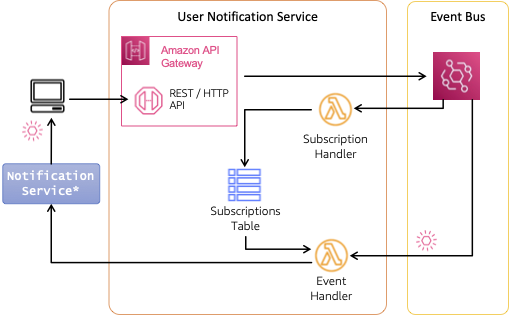

# Patterns for building event-driven web and mobile app backends

User interfaces by their nature are event driven - interactions trigger events that drive the application. But integrations between frontend and backend are often built synchronously using a request/response pattern. The samples in this repository explore patterns to enable asynchronous, event-driven integrations with the frontend. These real-world patterns bring the agility and responsiveness of EDA across client-server interactions.

## Web Push Pattern

The web push pattern is an example of a different type of interaction than the other event-driven patterns included in this repository. Unlike patterns 1-4, push notifications exist outside the bounds of the frontend application and are integrated at the operating system (mobile) or browser (desktop).

To generate a push notification, we need to interact with the notification service provided by the operating system on mobile or browser on desktop. Services like [Amazon Pinpoint](https://aws.amazon.com/pinpoint/) and [Amazon SNS](https://aws.amazon.com/sns/) simplify integration with Apple's Push Notification Service (APNS) for iOS, Google's Firebase Cloud Messaging (FCM) for Android, and SMS for text messaging.



Users must subscribe to push notifications for your service in order to send messages. The service identifies itself using a VAPID (Voluntary Application Server Identification) keys. VAPID keys allow push service providers to identify senders, allowing them to identify the sender and confirm the validity of the subscription.

Our pattern creates two routes on an [Amazon API Gateway](https://aws.amazon.com/api-gateway/) that allow subscribers to (1) register (`/subscribe`) and (2) subscribe to order updates (`/subscribe/order`). Both are implemented in [`template.yaml`](./template.yaml) as service proxies to [Amazon EventBridge](https://aws.amazon.com/eventbridge/). The payload is published as an event (e.g., "New subscription") to an event bus and is then handled by an [AWS Lambda](https://aws.amazon.com/lambda/) function, [`handleSubscribe.js`](./functions/handleSubscribe.js).

When a user subscribes, the service stores subscription information in an [Amazon DynamoDB](https://aws.amazon.com/dynamodb/) table. The subscription information includes a unique endpoint at the browser push service and keys that allow our service to publish the notification. Later, when the user simulates an order in the frontend, the service associates the order with the user's subscription via the `/subscribe/order` call.

As order state changes, events are delivered by an EventBridge rule to a [Lambda function](./functions/handleOrderEvents.js) (note that the rule is configured to only invoke the function for `OUT_FOR_DELIVERY` events). The function first checks for subscriptions to this order and, if any exist, sends the push notification. We use the [`web-push`](https://www.npmjs.com/package/web-push) to simplify sending push notifications to various notification services. We chose to implement an approach that calls the browser notification service directly to highlight the concept and avoid adding additional dependencies.

### Frontend integration

Web push notifications require the use of a [service worker](https://developer.mozilla.org/en-US/docs/Web/API/Service_Worker_API) to register for and receive push notifications. Details on service workers are beyond the scope of this project, please see the Additional references section for more details. The basic service worker for this pattern is defined at [`service-worker.js`](../../frontend/public/service-worker.js).

Browsers such as Safari require that a user interaction initiate the subscription request. Implementation can be found in [`Subscribe.jsx`](../../frontend/src/components/Subscribe.jsx) and on [web.dev](https://web.dev/articles/push-notifications-subscribing-a-user). In this implementation, after the user approves the subscription, the subscription payload (including endpoint) is published to `/subscribe` as described above.

To simulate placing an order (and kick-off the demo), the user clicks the "Start Simulation" button in the [`PlaceNewOrder.jsx` component](../../frontend/src/components/PlaceNewOrder.jsx). The response includes the `orderId`. We associate the order with the subscription by subsequently calling the `/subscribe/order` endpoint with the `orderId` and hash of the subscription endpoint.

The service worker is listening for push notifications and will publish when it receives the `OUT_FOR_DELIVERY` notification for the order (this may take a few minutes).

## Deployment

Web push notifications require creation of VAPID keys to uniquely identify the sender. VAPID keys can be generated by visiting [https://web-push-codelab.glitch.me/](https://web-push-codelab.glitch.me/) and noting the public and private keys. You will need these keys to deploy the push stack and to configure the frontend.

To deploy this pattern, use [AWS SAM CLI](https://docs.aws.amazon.com/serverless-application-model/latest/developerguide/install-sam-cli.html):

``` bash
sam build && sam deploy --guided
```

Respond to the prompts:

  - `Stack Name [patterns-eventdriven-frontends-push]:` *enter your own stack name or accept default*
  - `AWS Region [us-west-2]:` *select a Region, any will work*
  - `Parameter ProjectName [patterns-eventdriven-frontends]:` *keep the default or select your own*
  - `Parameter WebPushPublicToken []:` *provide your public web push token - see details above*
  - `Parameter WebPushPrivateToken []:` *provide your private web push token - see details above*
  - `Confirm changes before deploy [y/N]:` *N*
  - `Allow SAM CLI IAM role creation [Y/n]:` *Y*
  - `Disable rollback [y/N]:` *N*
  - `Save arguments to configuration file [Y/n]:` *Y*
  - `SAM configuration file [samconfig.toml]:` *accept default*
  - `SAM configuration environment [default]:` *accept default*

### Configure frontend

To configure the frontend demo application, you will need the `mqttEndpoint` for your AWS account (see above).

In the `frontend/src/appconfig.js`, update the value as shown below:

``` js
  push: {
    applicationServerKey: "" // your public key for web push, see above for details
  }
```

## Additional resources

- https://web.dev/articles/push-notifications-subscribing-a-user
- https://blog.stackademic.com/mastering-web-push-notifications-in-react-and-node-one-stop-guide-15de9567aa9a