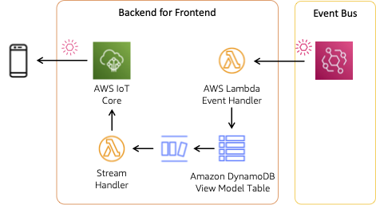

# Patterns for building event-driven web and mobile app backends

User interfaces by their nature are event driven - interactions trigger events that drive the application. But integrations between frontend and backend are often built synchronously using a request/response pattern. The samples in this repository explore patterns to enable asynchronous, event-driven integrations with the frontend. These real-world patterns bring the agility and responsiveness of EDA across client-server interactions.

## Pattern #4: AWS IoT Core

Pattern #4 leverages [AWS IoT Core](https://aws.amazon.com/iot-core/) to deliver updates to subscribers. IoT Core provides bi-directional connectivity between internet-connected devices and the cloud via [MQTT](https://mqtt.org/) and other protocols. IoT Core is targeted for devices such as sensors and embedded devices but is also an effective (and easy-to-use) channel to publish events to frontend applications.

Clients connect to an IoT Core endpoint that is unique to your AWS account and region. The client will then subscribe to one or more topics to receive messages published on this topic (MQTT even supports wildcards). Pattern 4 will only make use of server to client communication. Clients must be authorized to connect using one of the following identity principals: [X509 certificate, Amazon Cognito identities, or AWS IAM users, groups, or roles](https://docs.aws.amazon.com/iot/latest/developerguide/client-authentication.html).



Events are delivered by an [Amazon EventBridge](https://aws.amazon.com/eventbridge/) rule to an [AWS Lambda](https://aws.amazon.com/lambda/) function that writes to a view model stored in an [Amazon DynamoDB](https://aws.amazon.com/dynamodb/) table. Updates to that table are published on a [DynamoDB Stream](https://docs.aws.amazon.com/amazondynamodb/latest/developerguide/Streams.html). A second Lambda function (stream handler) processes batches of changes on the stream. Records passed in the batch can be filtered to only records of interest, this reduces cost and eliminates unnecessary invocations of the function.

The stream handler function publishes the event to the regional IoT Core endpoint using the AWS SDK `Publish` API. All events are published on a defined topic named `orders/events`. The approach implemented here is effectively a broadcast as all subscribers will receive all order events. We can easily add point-to-point updates by publishing to a more specific topic, such as `orders/events/my_order_id`. Subscribers to the expanded topic would receive only applicable events.

Publishing to a more specific topic is somewhat trivial, we just need to change the name of the topic. For example, update [`handleStream.js`](./functions/handleStream.js) as shown below.

``` javascript
const create = async(order) => {
  await publish({
    topic: `${OrdersTopic}/${order.orderId}`,
    payload: {
      orderId: order.orderId,
      status: order.status,
      updatedAt: order.updatedAt,
      event: "CREATED"
    }
  });
};
```

When publishing more specific order updates, consider also updating the approach to authorization for those topics (else, anyone could track the status of your food delivery). We would do this by (1) creating authenticated user accounts using [Amazon Cognito User Pools](https://docs.aws.amazon.com/cognito/latest/developerguide/cognito-user-identity-pools.html) or a similar service that the user would assume on frontend login and (2) updating the permissions associated with user roles to only allow access to their order topic(s). The specifics of this change are outside the scope of this project.

### Frontend integration

The frontend integration for this pattern can be found in the [`Pattern4` component](../../frontend/src/components/Pattern4a.jsx) and [`MqttClientProvider`](../../frontend/src/mqtt/MqttClientProvider.jsx). Most connection details can be found in the provider, usage in the component.

The `MqttClientProvider` is built with the [AWS IoT Device SDK for JavaScript](https://github.com/aws/aws-iot-device-sdk-js-v2/tree/main). There are other options to connect to MQTT topics, though the Device SDK provides ready handling of [AWS SigV4](https://docs.aws.amazon.com/AmazonS3/latest/API/sig-v4-authenticating-requests.html) signing of requests. The provider pattern is an approach in React to provide context or data to children components without passing as properties, implementation using other client frameworks may differ.

> Note that you may see two MQTT tunnels open when running the frontend application in development mode. This is a byproduct of [React `StrictMode`](https://react.dev/reference/react/StrictMode) and (we believe) a race condition in creating and tearing down connections. The race condition does not occur when `StrictMode` is removed or the application is run in production mode.

## Deployment

IoT Core provides an [endpoint](https://docs.aws.amazon.com/iot/latest/developerguide/iot-connect-devices.html#iot-connect-device-endpoints) that is unique to your account and region. To find the endpoint for a region, use the `describe-endpoint` CLI command:

``` bash
aws iot describe-endpoint --endpoint-type iot:Data-ATS
```

You can also find the endpoint in the [AWS IoT Core console](https://console.aws.amazon.com/iot/home#/settings) settings page. Look for **Endpoint** in the **Device data endpoint** panel. Make note of the endpoint, we refer to it as `mqttEndpoint` moving forward.

To deploy this pattern, use [AWS SAM CLI](https://docs.aws.amazon.com/serverless-application-model/latest/developerguide/install-sam-cli.html):

``` bash
sam build && sam deploy --guided
```

Respond to the prompts:

  - `Stack Name [patterns-eventdriven-frontends-pattern3]:` *enter your own stack name or accept default*
  - `AWS Region [us-west-2]:` *select a Region, any will work*
  - `Parameter ProjectName [patterns-eventdriven-frontends]:` *keep the default or select your own*
  - `Parameter IoTCoreEndpoint []:` *provide your mqttEndpoint - see details above*
  - `Confirm changes before deploy [y/N]:` *N*
  - `Allow SAM CLI IAM role creation [Y/n]:` *Y*
  - `Disable rollback [y/N]:` *N*
  - `Save arguments to configuration file [Y/n]:` *Y*
  - `SAM configuration file [samconfig.toml]:` *accept default*
  - `SAM configuration environment [default]:` *accept default*

### Configure frontend

To configure the frontend demo application, you will need the `mqttEndpoint` for your AWS account (see above).

In the `frontend/src/appconfig.js`, update the value as shown below:

``` js
  mqttEndpoint: "", // IoT Core endpoint for your account, see detail above
```