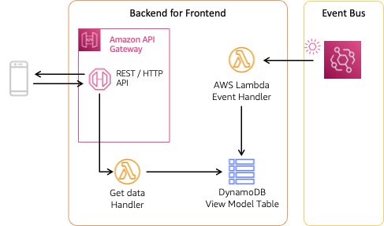

# Patterns for building event-driven web and mobile app backends

User interfaces by their nature are event driven - interactions trigger events that drive the application. But integrations between frontend and backend are often built synchronously using a request/response pattern. The samples in this repository explore patterns to enable asynchronous, event-driven integrations with the frontend. These real-world patterns bring the agility and responsiveness of EDA across client-server interactions.

## Polling

The polling pattern repeatedly requests data from the REST API endpoint at a configurable interval. The client is responsible for finding the delta from the existing data and newly returned records. Polling is somewhat common and, while it appears simple, can become complex as you need to calculate data changes, manage server load, and potentially make multiple API requests to determine current state.

This pattern utilizes [Amazon API Gateway](https://aws.amazon.com/api-gateway/) to provide a managed REST endpoint. The client connects using familiar REST semantics and requests data.



Events are delivered by an [Amazon EventBridge](https://aws.amazon.com/eventbridge/) rule to an [AWS Lambda](https://aws.amazon.com/lambda/) function that writes to a view model stored in an [Amazon DynamoDB](https://aws.amazon.com/dynamodb/) table.

When requested, a Lambda function retrieves orders (or a specific order) from the DynamoDB table. The response payload is defined by the server. Builders may use specifications such as [OpenAPI](https://www.openapis.org/) or a developer portal to communnicate the schema of the request and response payloads.

### Frontend integration

The frontend integration for this patterns use the [AWS Amplify API](https://docs.amplify.aws/gen1/javascript/build-a-backend/restapi/set-up-rest-api/) library. Implementation can be found in [frontend/src/components/Polling.jsx](../../frontend/src/components/Polling.jsx).

Amplify simplifies signing requests with [AWS SigV4](https://docs.aws.amazon.com/AmazonS3/latest/API/sig-v4-authenticating-requests.html). The client uses a common guest profile with access to the REST endpoint exposed through AWS API Gateway.

## Deployment

To deploy this pattern, use [AWS SAM CLI](https://docs.aws.amazon.com/serverless-application-model/latest/developerguide/install-sam-cli.html):

``` bash
sam build && sam deploy --guided
```

Respond to the prompts:

  - `Stack Name [patterns-eventdriven-frontends-push]:` *enter your own stack name or accept default*
  - `AWS Region [us-west-2]:` *select a Region, must support Bedrock*
  - `Parameter ProjectName [patterns-eventdriven-frontends]:` *keep the default or select your own*
  - `Confirm changes before deploy [y/N]:` *N*
  - `Allow SAM CLI IAM role creation [Y/n]:` *Y*
  - `Disable rollback [y/N]:` *N*
  - `Save arguments to configuration file [Y/n]:` *Y*
  - `SAM configuration file [samconfig.toml]:` *accept default*
  - `SAM configuration environment [default]:` *accept default*

### Configure frontend

To configure the frontend demo application, you will need the `mqttEndpoint` for your AWS account (see above).

In the `frontend/src/appconfig.js`, update the value as shown below:

``` js
  polling: {
    endpoint: "" // `ApiEndpoint` from polling stack output
  },
```